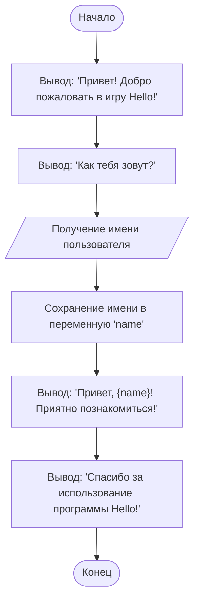

```python
# Игра Hello
# Эта программа выводит приветствие пользователю.
# Это одна из самых простых программ, которая демонстрирует базовые команды Python.

# Вывод приветствия на экран
print("Привет! Добро пожаловать в игру Hello!")  # Используем функцию print для вывода текста

# Запрос имени пользователя
name = input("Как тебя зовут? ")  # Используем функцию input для получения данных от пользователя

# Вывод персонализированного приветствия
print(f"Привет, {name}! Приятно познакомиться!")  # Используем f-строку для подстановки имени в текст

# Дополнительное сообщение
print("Спасибо за использование программы Hello!")
```

---

### **Пояснения к коду:**
1. **`print()`** – Функция для вывода текста на экран. В данном случае используется для приветствия пользователя.
2. **`input()`** – Функция для получения данных от пользователя. В данном случае запрашивается имя.
3. **f-строки** – Используются для подстановки переменных в строку. Например, `{name}` подставляет значение переменной `name`.
4. **Переменная `name`** – Хранит имя, введённое пользователем.

---

### **Как работает программа:**
1. Программа выводит приветствие.
2. Запрашивает у пользователя его имя.
3. Выводит персонализированное приветствие, используя введённое имя.
4. Завершает работу с дополнительным сообщением.

---

### **Пример выполнения программы:**
```
Привет! Добро пожаловать в игру Hello!
Как тебя зовут? Иван
Привет, Иван! Приятно познакомиться!
Спасибо за использование программы Hello!
```
### **Блок-схема**


Легенда
1. **`Start`** – Начало программы.
2. **`DisplayWelcome`** – Вывод приветствия пользователю.
3. **`AskName`** – Вывод запроса имени пользователя.
4. **`GetUserName`** – Получение имени от пользователя.
5. **`StoreName`** – Сохранение имени в переменную `name`.
6. **`DisplayGreeting`** – Вывод персонализированного приветствия с использованием переменной `name`.
7. **`DisplayThanks`** – Вывод сообщения о завершении программы.
8. **`End`** – Конец программы.

Запустить код в [google colab](https://colab.research.google.com/github/hypo69/101_python_computer_games_ru/blob/master/GAMES/HELLO/101bcg_ru_hello.ipynb)


### В эпоху AI код тоже должен соответствовать времени. Посмотри современную версию Hello, World!

В прошлом посте я начал показывать простые решения для начинающих изучать Python. Как и во всех учебниках программирования, я начал с классического примера "Hello, World!". В ней главный акцент я поставил не на коде, а на комментариях. Не ленись писать комментарии. Не надейся на свою память. С ростом сложности кода ты обязательно забудешь, что писал на прошлой неделе или месяц назад. Твой код кто-то будет читать, а хорошо задокументированный код читается как приключенческий роман. Плохо задокументированный код, с непонятными именами переменных и функций, с запутанной логикой сразу хочется выбросить в помойку.

В эпоху AI код тоже должен соответствовать времени. Посмотри современную версию Hello, World! — интерактивный пример, который позволяет взаимодействовать с моделью искусственного интеллекта Gemini от Google. Этот пример показывает, как можно использовать Python для общения с AI и получения ответов на свои вопросы.

### Задай вопрос модели Gemini

API КЛЮЧ К МОДЕЛИ ЗДЕСЬ: [https://aistudio.google.com/](https://aistudio.google.com/)

```python
import google.generativeai as genai

class GoogleGenerativeAI:
    """
    Класс для взаимодействия с моделями Google Generative AI.
    """

    MODELS = [
        "gemini-1.5-flash-8b",
        "gemini-2-13b",
        "gemini-3-20b"
    ]

    def __init__(self, api_key: str, model_name: str = "gemini-2.0-flash-exp"):
        """
        Инициализация модели GoogleGenerativeAI.

        Аргументы:
            api_key (str): Ключ API для доступа к генеративной модели.
            model_name (str, optional): Название модели для использования. По умолчанию "gemini-2.0-flash-exp".
        """
        self.api_key = api_key
        self.model_name = model_name
        genai.configure(api_key=self.api_key)
        self.model = genai.GenerativeModel(model_name=self.model_name)

    def ask(self, q: str) -> str:
        """
        Отправляет текстовый запрос модели и возвращает ответ.

        Аргументы:
            q (str): Вопрос, который будет отправлен модели.

        Возвращает:
            str: Ответ от модели.
        """
        try:
            response = self.model.generate_content(q)
            return response.text
        except Exception as ex:
            return f"Error: {str(ex)}"
```

### Как это работает?

1. **Импорт библиотеки**: Мы импортируем библиотеку `google.generativeai`, которая предоставляет интерфейс для взаимодействия с моделями Google AI.

2. **Класс `GoogleGenerativeAI`**: Этот класс инкапсулирует всю логику взаимодействия с моделью Gemini. Он принимает API-ключ и имя модели в качестве параметров. По умолчанию используется модель `gemini-2.0-flash-exp`.

3. **Метод `__init__`**: В этом методе происходит настройка модели. Мы передаем API-ключ и имя модели, а затем инициализируем объект модели.

4. **Метод `ask`**: Этот метод отправляет текстовый запрос модели и возвращает ответ. Если что-то пойдет не так, метод вернет сообщение об ошибке.

### Как использовать?

```python
################################################################################
#                                                                              #
#             INSERT YOUR GEMINI API KEY                                       #
#                                                                              #
################################################################################

API_KEY: str = input("API ключ от `gemini`: ")
model = GoogleGenerativeAI(api_key=API_KEY)

q = input("Вопрос: ")
response = model.ask(q)
print(response)
```

1. **Ввод API-ключа**: Сначала программа запрашивает у пользователя API-ключ для доступа к модели Gemini. Этот ключ можно получить на сайте [Google AI Studio](https://aistudio.google.com/).

2. **Создание объекта модели**: Мы создаем объект класса `GoogleGenerativeAI`, передавая ему API-ключ.

3. **Ввод вопроса**: Пользователь вводит свой вопрос, который хочет задать модели.

4. **Получение ответа**: Программа отправляет вопрос модели и выводит ответ на экран.

### Пример использования

Предположим, у вас есть API-ключ, и вы хотите спросить модель: "Как улучшить мой код?". Вот как это будет выглядеть:

```
API ключ от `gemini`: ваш_api_ключ
Вопрос: Как улучшить мой код?
Ответ: Для улучшения вашего кода рекомендуется следовать принципам чистого кода, таким как именование переменных и функций понятно и логично, использование комментариев для объяснения сложной логики, а также применение принципов SOLID для проектирования классов и модулей.
```

### Заключение

Современный мир программирования невозможно представить без искусственного интеллекта. Этот пример показывает, как легко можно интегрировать AI в свои проекты и использовать его для решения задач. Не забывайте, что даже в эпоху AI ваш код должен быть чистым, понятным и хорошо документированным. Ведь именно такой код становится настоящим приключенческим романом для тех, кто будет его читать.


